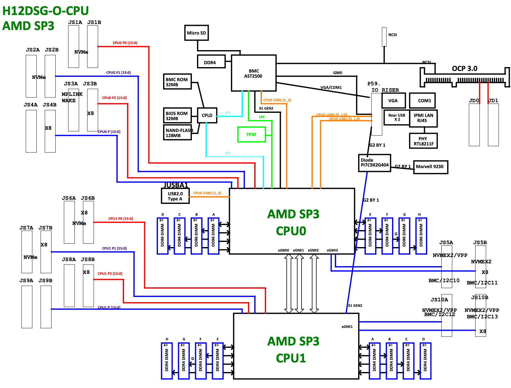
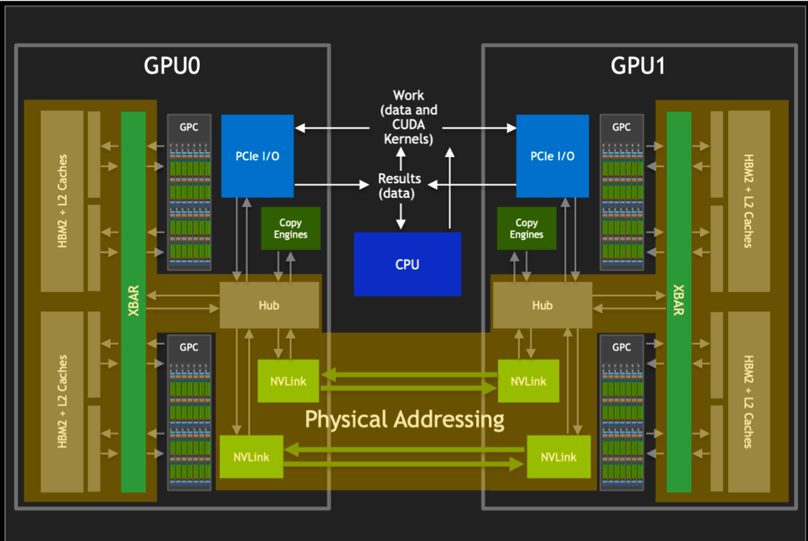
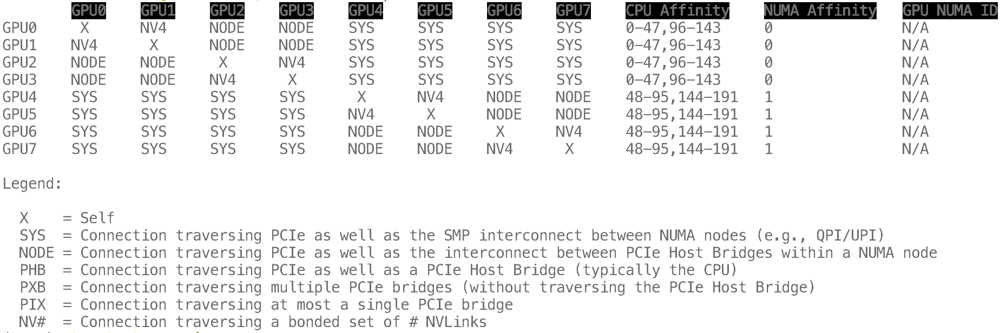
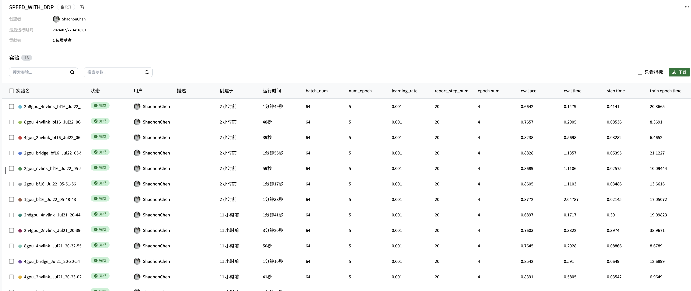
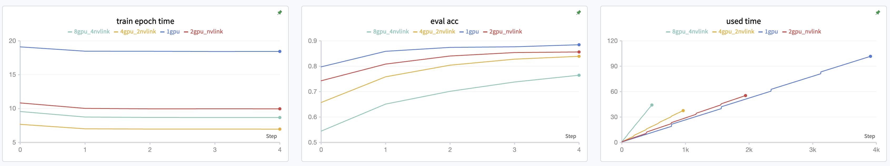
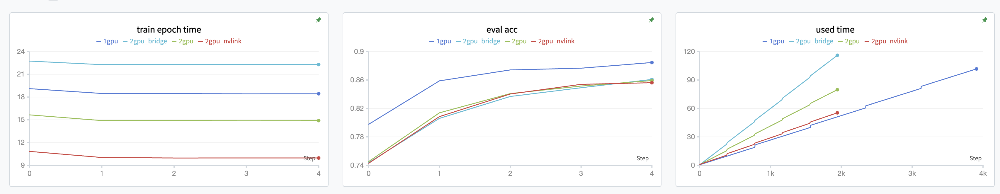
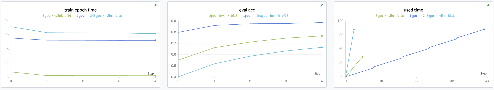
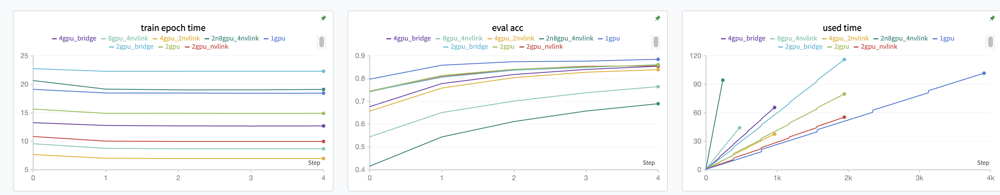

# 教程向：如何提高多卡训练速度（附github代码+实验结果）


## 摘要

数据并行（DDP）的多卡训练能够显著减少模型的训练时长。但是由于显卡带宽，同步等问题，多卡训练往往会带来一定的性能损耗。较少人关注到选择不同位置的GPU会带来不同的并行效率，本文主要是探讨实验室常见的机型配置，包括NVLink，PCIE-bridge等硬件对训练效率产生的影响，并探讨了多节点训练的训练效率与训练损耗。

## 前置知识

本文默认读者已经有深度学习基础、并且了解pytorch的DDP原理。后文重点关注多卡训练时硬件侧会影响训练效率的部分。如果需要了解基础知识，可查阅文末附的优秀博客。

### 为什么要多卡训练

在以前大多数情况下多卡训练都是为了加速。比如用TitianRTX 24G显卡在[ImageNet数据集](https://www.image-net.org/index.php)上跑[Resnet50](https://arxiv.org/abs/1512.03385)从零训练，大概要跑4-5天。但是如果有8张卡就可以1天多跑完。

### 多卡训练的原理简单回顾

简单说明DDP的工作原理就是。假设我们想在八张显卡上训练模型。我们就将模型复制八份到每一张显卡上，然后数据切分成八份在8张卡上，然后让每张卡都进行前向传递和反向传播，每个batch执行完后八张卡要进行一次all reduce来同步权重（不然八张卡上的权重会变的不一样）。过程类似下图。


但执行效率的损失坏就坏在八张卡要同步上，为了保证八张卡的权重一次，每次batch都需要同步一次，会引入两个问题：

1. 每次同步卡间传输的参数量超大
2. 如果有卡提前计算完了，要等其他卡也计算完。相当于每个batch的速度取决于最慢的卡。

第一点是后文主要讨论的内容，第二点的话需要注意就是假设你要在GPU0,1,2,3上开启实验，你发现GPU2已经有人在训练了，就不要用了，因为单块卡就会直接拖慢剩余3块卡的速度。

除了模型并行外，还有没有别的方法呢。也有，比如[参数服务器parameters server原理](https://link.zhihu.com/?target=https%3A//kknews.cc/code/y5aejon.html)这个就是异步的计算。但一般实验室也就是撑死了八块卡，其实这个效率还算能接受。

### 影响带宽的硬件因素

那么，因为DDP的多卡训练，卡间通信是拖慢速度的主要因素。如何提高卡间通信速度呢。首先要先理解多GPU服务器的结构。

首先一个常见的误区就是很多人会以为插在同一个电脑（服务器）中的八块卡间传输效率一样。实际上如果是一般的单CPU4卡台式机，确实差别不会很明显。因为所有的显卡都在一个PCIe桥或者直连CPU。

但是如果是八卡服务器，一般是带两个CPU的。八张卡会分为两组：0，1，2，3GPU在CPU0，4，5，6，7在CPU1。这里以常用的超微4124八卡服务器为例，[官方文档](https://www.supermicro.com/manuals/superserver/4U/MNL-2302.pdf) 可以看到连卡的PCIe被分为了两组分别连在两个CPU上。如果跨组调用GPU将带来较大的延迟。



那么第二个就是是否使用[NVLink](https://www.nvidia.com/en-us/data-center/nvlink/)了。NVLink可以说是老黄黑科技，在显卡间搭建了直连通道，数据不需要走PCIe就能直接在卡间传输。并且带宽、延迟、速度都显著超过走PCIe。（似乎多卡训练时需要指定使用nccl作为后端才能使用，这个待测试。）



这里可以使用nvidia-smi的命令查看卡间是否有nvlink加速（当然如果不是PCIe卡，而是NVSwitch就不用关注这个了，直接随便选着用就行），使用如下命令查看显卡间连接拓扑图：

```
nvidia-smi topo -m
```

结果如下，可以看到0-3号GPU是在同一CPU上的，4-7GPU是在另一个CPU上。0-1，2-3，4-5，6-7GPU之间使用了NVLink连接，NVLink版本为4。使用NVLink能够极大提升卡间通信速度，尤其是在张量并行的情况下。



那么如果需要跨节点进行超过八卡的训练，比如两节点16卡训练，那么就要关注网络带宽了，一般推荐节点间采用40G光互联的方式。如果没条件使用10G网线互联也是可以的。一块10G双口网卡二手也就100来块钱，线的成本忽略不计。主要是10G交换机会贵一点（8口便宜的1-2000），如果是两个节点的GPU服务器可以考虑直接两台服务器直连，成本能低不少，不止两个节点的实验室也不差钱买台40G光交换机了。

## 实验

这里将重点比较下，训练代码完全一致，只是调用在不同位置的GPU，产生的训练性能差异。

### 实验环境

这里采用[huggingface accelerate](https://huggingface.co/docs/accelerate/main/en/index)来完成多卡、多节点的启动。使用[SwanLab](http://swanlab.cn/)进行训练跟踪。

训练任务选用的是使用[Resnet18](https://arxiv.org/abs/1512.03385)进行[CIFAR10数据集](https://www.cs.toronto.edu/~kriz/cifar.html)分类。后续补一个使用transformers的实验（主要是折腾了半天transformers和accelerate的联动，没搞清楚他俩间什么关系）。

**对于Accelerate不了解的同学可以参考我的另一篇博客[入门向Accelerate教程](https://zhuanlan.zhihu.com/p/702467790)**

相关代码开源在[github项目](https://github.com/ShaohonChen/speed_with_ddp.git)上，欢迎Star👏。实验结果可参考[SwanLab项目](https://swanlab.cn/@ShaohonChen/SPEED_WITH_DDP/overview)

**硬件环境**

- 服务器：2xsupermicro4124gs-tnr + 192core-512G-RAM
- 显卡类型：8x RTX3090 4xNVLink
- 服务器间连接：10G电口，过交换机

**软件环境+代码**

- Ubuntu24.04 + Python3.11 + CUDA12.1
- 实验代码：<https://github.com/ShaohonChen/speed_with_ddp.git>

### 完整训练代码

建议参考[github项目](https://github.com/ShaohonChen/speed_with_ddp.git)获得完整代码。实验结果也开源在[SwanLab项目](https://swanlab.cn/@ShaohonChen/SPEED_WITH_DDP/overview)上



### 实验结果

**单GPU、2xGPU-NVLINK、4xGPU-NVLINK、8xGPU-NVLINK对比**

图中train epoch time表示单epoch使用的秒数，eval acc表示随epoch数的测试精度、used time表示随着step的实验运行时长。



这里可以看到从效率上来说多GPU的提升还是很明显的，但是两卡以上差别就不大了。主要原因也是cifar+resnet18这个训练任务本身非常轻量，如果是更大显存的任务效率提升会更明显些。8GPU的效率反而没有4GPU快也是因为跨了PCIe桥带来的极大带宽损失，下面的实验会更明显说明这个问题。

除此之外，由于GPU数量变动，数据量不变的情况下迭代的次数变少，所以最终恶霸了精度单卡精度较高。实际训练时一定要记得GPU数量变多要适当调大初始学习率，并且无论单卡多卡一定要上学习率衰减（因为该实验目的是为了比较速度，所以没上）

**2GPU，2GPU带NVLINK，2GPU跨PCIe桥对比**

图中train epoch time表示单epoch使用的秒数，eval acc表示随epoch数的测试精度、used time表示随着step的实验运行时长。



可以看到，跨PCIe Bridge调用2个GPU带来的性能收益甚至不如直接用单卡训练来的快。选用NVLINK的卡进行并行能带来极大的性能提升。

**扩展到多节点**

这里我们以2节点16块GPU为例，进行了实验

图中train epoch time表示单epoch使用的秒数，eval acc表示随epoch数的测试精度、used time表示随着step的实验运行时长。



实际上可以看到，多节点并没有想象中带来性能的提升。反而由于带宽问题，16块卡的总用时（间右图）刚刚与单卡时长打平。当然可能随着训练epoch数的增加，数据、模型规模的增加最终16卡是能胜过单卡的。但是相比之下八卡还是性价比极高的选项。一般不是模型非常大（比如单卡放不下）或者要求的batch数非常大的情况下不建议用多节点训练。还不如多跑俩实验来来的收益大。只有batch数很大或者使用了梯度叠加之类的技术，多卡甚至多节点的收益才会逐渐显现出来。

**哪种方案才能真正省时间**

这里面最后对比一下单卡，多卡，NVLink和跨PCIe bridge的区别。

图中train epoch time表示单epoch使用的秒数，eval acc表示随epoch数的测试精度、used time表示随着step的实验运行时长。



这里可以看到，再众多方案中。**单节点单个Bridge内4GPU**的实验整体时间最短，可以说是性价比绝佳的方案。

## 环境安装与实验复现

上述实验的复现命令

### 环境安装

```
pip install -r requirements.txt
```

### 实验命令

**暂时无法使用 1kernal AMD EPYC 7R32 48-Core Processor**

```
accelerate launch --config_file=accelerate_configs/1cpu.yaml train_cifar_acc.py 1cpu
```

**暂时无法使用 16kernal AMD EPYC 7R32 48-Core Processor**

```
accelerate launch --config_file=accelerate_configs/16cpu.yaml train_cifar_acc.py 16cpu
```

**1XRTX3090 GPU**

```
accelerate launch --config_file=accelerate_configs/1gpu.yaml train_cifar_acc.py 1gpu
```

**1XRTX3090 GPU bf16**

```
accelerate launch --config_file=accelerate_configs/1gpu_bf16.yaml train_cifar_acc.py 1gpu_bf16
```

**2XRTX3090 GPU**

```
accelerate launch --config_file=accelerate_configs/2gpu.yaml train_cifar_acc.py 2gpu
```

**2XRTX3090 GPU bf16**

```
accelerate launch --config_file=accelerate_configs/2gpu_bf16.yaml train_cifar_acc.py 2gpu_bf16
```

**2XRTX3090 GPU NVLINK**

```
accelerate launch --config_file=accelerate_configs/2gpu_link.yaml train_cifar_acc.py 2gpu_nvlink
```

**2XRTX3090 GPU NVLINK bf16**

```
accelerate launch --config_file=accelerate_configs/2gpu_link_bf16.yaml train_cifar_acc.py 2gpu_nvlink_bf16
```

**2XRTX3090 bridge**

```
accelerate launch --config_file=accelerate_configs/2gpu_2c.yaml train_cifar_acc.py 2gpu_bridge
```

**2XRTX3090 bridge bf16**

```
accelerate launch --config_file=accelerate_configs/2gpu_2c_bf16.yaml train_cifar_acc.py 2gpu_bridge_bf16
```

**4XRTX3090 2nvlink**

```
accelerate launch --config_file=accelerate_configs/4gpu_2link.yaml train_cifar_acc.py 4gpu_2nvlink
```

**4XRTX3090 2nvlink bf16**

```
accelerate launch --config_file=accelerate_configs/4gpu_2link_bf16.yaml train_cifar_acc.py 4gpu_2nvlink_bf16
```

**4XRTX3090 bridge**

```
accelerate launch --config_file=accelerate_configs/4gpu_2c.yaml train_cifar_acc.py 4gpu_bridge
```

**8XRTX3090 4nvlink**

```
accelerate launch --config_file=accelerate_configs/8gpu_4link.yaml train_cifar_acc.py 8gpu_4nvlink
```

**8XRTX3090 4nvlink bf16**

```
accelerate launch --config_file=accelerate_configs/8gpu_4link_bf16.yaml train_cifar_acc.py 8gpu_4nvlink_bf16
```

**2node 4XRTX3090 2nvlink**

node 0 (172.16.6.4)

```
accelerate launch --config_file=accelerate_configs/2n4g_n0.yaml train_cifar_acc.py 2n4gpu_2nvlink
```

node 1 (172.16.6.3)

```
accelerate launch --config_file=accelerate_configs/2n4g_n1.yaml train_cifar_acc.py 2n4gpu_2nvlink
```

**2node 8XRTX3090 4nvlink**

node 0 (172.16.6.4)

```
accelerate launch --config_file=accelerate_configs/2n8g_n0.yaml train_cifar_acc.py 2n8gpu_4nvlink
```

node 1 (172.16.6.3)

```
accelerate launch --config_file=accelerate_configs/2n8g_n1.yaml train_cifar_acc.py 2n8gpu_4nvlink
```

**2node 8XRTX3090 4nvlink bf16**

node 0 (172.16.6.4)

```
accelerate launch --config_file=accelerate_configs/2n8g_n0_bf16.yaml train_cifar_acc.py 2n8gpu_4nvlink_bf16
```

node 1 (172.16.6.3)

```
accelerate launch --config_file=accelerate_configs/2n8g_n1_bf16.yaml train_cifar_acc.py 2n8gpu_4nvlink_bf16
```

## 相关博客

阅读本文需要提前了解的知识，并附上优秀的博客（需要的话查阅，不用全都读一遍）

- 有一定深度学习基础
  - 吴恩达CS231n课程，经典入门[b站有人搬运的吴恩达视频](https://www.bilibili.com/video/BV1FT4y1E74V)
- 了解过pytorch进行深度学习训练
  - pytorch官方60分钟入门博客[github有人翻译的中文版](https://github.com/fendouai/PyTorchDocs)
  - 入门向深度学习教程[猫狗分类任务](https://zhuanlan.zhihu.com/p/698676558)
  - 大模型微调教程[qwen2微调](https://zhuanlan.zhihu.com/p/702491999)
- 了解pytorch的数据并行（DDP）训练原理
  - pytorch数据并行原理[知乎系列专刊](https://zhuanlan.zhihu.com/p/178402798)
  - pytorch多机多卡实验代码[带代码优秀教程](https://zhuanlan.zhihu.com/p/489011749)
